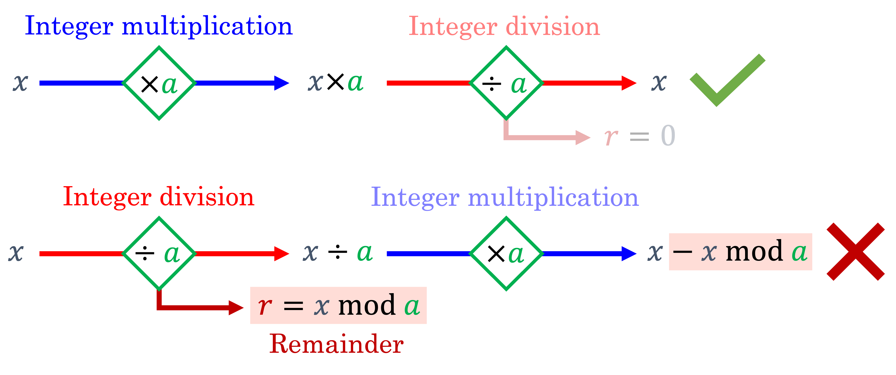
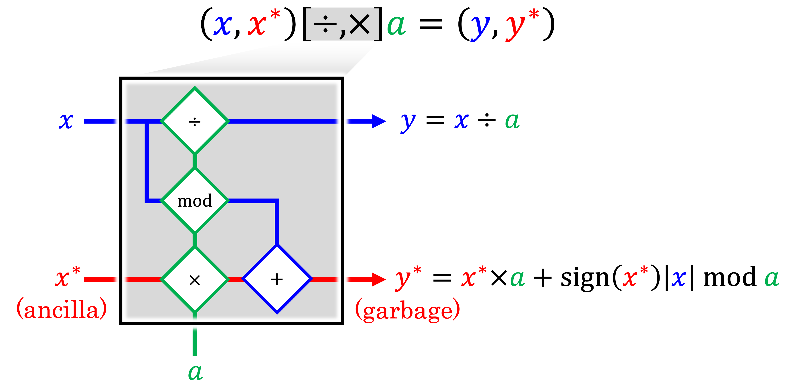
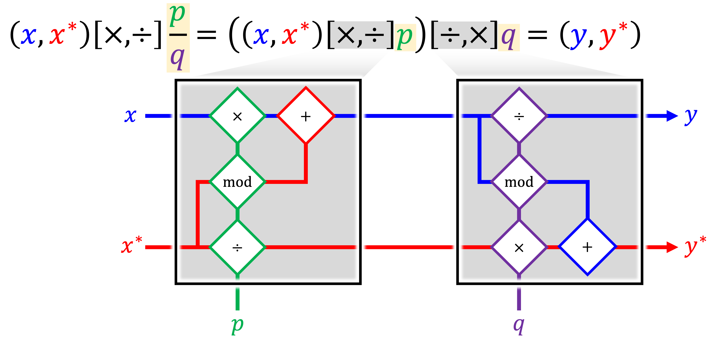

.. _Background:

Background
==========

The domain of *reversible computing* is a well-established field of study which has been applied in a variety of contexts, including simulation of time-reversible physical systems,\ :footcite:p:`hoover_2012` and reversible cellular automata.\ :footcite:p:`morita_2017`
Regarding the simulation of physical systems, it is generally well-known that Hamiltonian systems exhibiting time-symmetric behavior can be *formally* reversed in time.
However, while symplectic time integrators for Hamiltonian systems may be used in an attempt to reverse the computations of a given time stepping scheme, naïve application of such methods will inevitably succumb to floating point arithmetic errors: hence, systems which are theoretically time-reversible are not necessarily reversible in a bitwise sense due to roundoff from finite precision arithmetic.

Nonetheless, strictly "bit-reversible" time integrators have been developed for various physical systems by exploiting fixed-precision arithmetic operations to achieve exactly reversible computations.
Motivated by the original work of :footcite:t:`levesque_1993` in developing an exactly bit-reversible molecular dynamics time integrator through the use of integer arithmetic, :footcite:t:`kum_1994` developed a bit-reversible time integrator applicable to continuum mechanics and smoothed particle hydrodynamics calculations. In parity with the approach of Levesque and Verlet, exact bit-reversibility was achieved by storing the simulation state information using fixed-point numeric representations. Intermediate computations were carried out using floating-point arithmetic, with the results of these computations subsequently truncated. More recent investigations have applied this same concept to the study of N-body dynamic systems,\ :footcite:p:`rein_2017` and for the computation of adjoint sensitivities for optimal control of chaotic dynamic systems.\ :footcite:p:`stam_2022`

Nonetheless, the aforementioned bit-reversible methods are still generally limited to Hamiltonian systems. In general, systems which are intended to represent thermodynamically irreversible processes entail apparent losses of total system energy due to dissipation mechanisms, which in a computational setting result in loss of information in the form of significant bits used to represent the state of the simulated system. To overcome these limitations, the strategy described in the following section is adopted.

Reversible Integer Arithmetic
-----------------------------

The central concept underpinning the developed bit-reversible computations for dissipative dynamic systems pertains to the use of paired integer arithmetic operations which preserve information (bits) that would otherwise be lost due to finite precision rounding errors. In particular, while integer multiplication is a perfectly reversible operation, Euclidean division of integers results in permanent loss (“dissipation”) of information in the form of the remainder after division:

To ensure that the integer division operation can be exactly reversed in a "bit-wise" sense, we must introduce an auxiliary variable to store the remainder. Ordinarily, the remainders of all such division operations would need to be stored until the operations are later reversed, but this may entail intractable memory requirements if many such operations are carried out. To reduce memory overheads, the approach suggested by :footcite:t:`maclaurin_2015` is adopted to define a *paired integer multiplication/division operation*, whereby the ancillary variables :math:`x^{*}` and :math:`y^{*}` are introduced to act as compact data buffers which continuously accumulate and preserve the remainders after division:

The inverse *paired integer division/multiplication operation* is obtained by permuting the inputs of the paired multiplication/division arithmetic gate, and is observed to result in a perfect bit-reversibility:

.. image:: _static/inverted_integer_arithmetic.png
   :width: 560

Moreover, bit-reversible fixed-point multiplication may be carried out by approximating the multiplicand as a *rational number*:
	   

This concept is applied such that any persistent stable variables :math:`x` (e.g. displacements, velocities, material history variables, etc.) are endowed with corresponding ancillary state variables :math:`x^{*}` subject to an extended set of rules for all basic arithmetic operations which ensure that the pairing of :math:`x` and :math:`x^{*}` efficiently preserves all bits that would otherwise be erased due to round-off.

A more detailed explanation of the motivation for REMAT and the concepts underpinning the proposed approach may be found in the following online presentation:

.. image:: https://img.youtube.com/vi/pld1zsDSUgs/maxresdefault.jpg
    :alt: Exactly Bit-Reversible Computational Methods for Dissipative Dynamic Systems
    :target: https://www.youtube.com/watch?v=pld1zsDSUgs
   
.. footbibliography::
